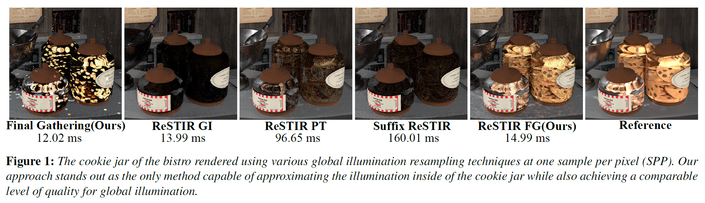

# ReSTIR FG: Real-Time Reservoir Resampled Photon Final Gathering

## Introduction
This repository contains the source code and an interactive demo for [the following EGSR paper:](https://diglib.eg.org/items/df98f89d-a0ca-4800-9bc4-74528feaf872)

> **[ReSTIR FG: Real-Time Reservoir Resampled Photon Final Gathering](https://diglib.eg.org/items/df98f89d-a0ca-4800-9bc4-74528feaf872)**  
> René Kern, Felix Brüll, Thorsten Grosch  
> TU Clausthal

This prototype implements ReSTIR FG, an efficient real-time global illumination algorithm that combines photon final gaterhing with reservoir resampling (ReSTIR). Additionally, our ReSTIR FG is able to display caustics in real-time. For direct light, [RTXDI](https://github.com/NVIDIAGameWorks/RTXDI) is used. This prototype also contains a denoised prototype using [DLSS](https://github.com/NVIDIA/DLSS) and [NRD](https://github.com/NVIDIAGameWorks/RayTracingDenoiser).

This repository also includes a simplified version of ReSTIR FG, called [ReSTIR FG Lite](#restir-fg-lite). This variant is designed to make it easier to learn the core algorithm and follows the notation used in the ["A gentle Introduction to ReSTIR" course](https://intro-to-restir.cwyman.org/). For more details, see [here](#restir-fg-lite).

This project was implemented using NVIDIA's Falcor rendering framework. See [README_Falcor.md](README_Falcor.md) for the readme provided with Falcor.

You can download the executable demo from the [Releases Page](https://github.com/TU-Clausthal-Rendering/ReSTIR-FG/releases/latest), or build the project by following the instructions in [Building Falcor](#building-falcor) or the build instructions in the original [readme](README_Falcor.md).

Teaser:

## Contents:

* [ReSTIR FG Lite](#restir-fg-lite)
* [Demo usage](#demo-usage)
* [Testing with more Scenes](#testing-with-more-scenes)
* [Falcor Prerequisites](#falcor-prerequisites)
* [Building Falcor](#building-falcor)

## ReSTIR FG Lite
ReSTIR FG Lite is a stripped-down version of our base variant, designed to highlight the core algorithm in a simpler form. The implementation follows the notation used in the ["A gentle Introduction to ReSTIR" course](https://intro-to-restir.cwyman.org/).

The algorithm works as follows:
1. **VBuffer Pass** - Acquire the first surface hit.
2. **Trace Photons** [(Shader)](Source/RenderPasses/ReSTIR_FG_Lite/TracePhotons.rt.slang)
    - Photons are only stored on diffuse surfaces. Photons are stored only on diffuse surfaces (classification is based on a roughness threshold, default = 0.25).
    - Photons are classified as *Global* (last hit diffuse) or *Caustic* (last hit specular).
    - Global photons are stochastically rejected with a fixed probability to reduce acceleration structure build time and relatively increase caustic photon density.
3. **Build the Photon Acceleration Structure**
    - Photons are stored as Axis-Aligned Bounding Boxes (AABBs) with their collection radius as extent.
4. **Generate Initial Final Gather and Caustic Reservoirs** [(Shader)](Source/RenderPasses/ReSTIR_FG_Lite/GenerateInitialSamples.rt.slang)
    - Reservoirs are initialized at the first diffuse surface. (For Final Gather, an additional ray is traced)
    - If the VBuffer surface is not diffuse, a ray is traced until one is found. (Or maximal ray depth is reached)
    - If the first surface is non-diffuse, caustic reservoirs also include Global photons with path length 0 (direct illumination), since RTXDI cannot properly handle these samples.
    - The RTXDI surface is also set in this step.
5. **Direct Light Sampling and Resampling** - performed with [RTXDI](https://github.com/NVIDIAGameWorks/RTXDI).
6. **Resample Final Gather Reservoirs** with spatiotemporal samples [(Shader)](Source/RenderPasses/ReSTIR_FG_Lite/ResampleReservoirFG.cs.slang).
7. **Resample Caustic Reservoirs** with (spatio)temporal samples [(Shader)](Source/RenderPasses/ReSTIR_FG_Lite/ResampleReservoirCaustic.cs.slang).
8. **Evaluate All Reservoirs** [(Shader)](Source/RenderPasses/ReSTIR_FG_Lite/EvaluateReservoirs.cs.slang).

(Shared structs and utility functions are located [here](Source/RenderPasses/ReSTIR_FG_Lite/StructsAndHelpers.slang)).

## Demo usage
After downloading the demo from the release page, you can execute it using either the `ReSTIRFGDemo_[SceneName].bat` file or the `ReSTIRFGDemoNRD_[SceneName].bat` file. We provide four scenes with the Demo, two are included in the git repo in the `Models` folder (VeachAjar and Sibernik). The other two scenes need to be downloaded separately (Kitchen and Bistro) from the [Releases Page](https://github.com/TU-Clausthal-Rendering/ReSTIR-FG/releases/latest) and unziped into the `Models` folder. For more scenes, see the [Testing with more Scenes](#testing-with-more-scenes) section.

To change the settings of our algorithm, navigate to the `ReSTIR_FG` group in the UI. In addition to `ReSTIR FG`, we have implemented `Final Gather` and `ReSTIR GI`, which can be switched in the UI. For more information about a setting, hover over the `(?)`.

Controls:
- `WASD` - Camera movement
- `Left Click` + `Mouse movement` - Change camera direction
- `Shift` - Speed up camera movement
- `Q, E` - Camera Down / UP
- `P` - Opens the profiler that shows the Rendertime for each Pass ('ShadowPass' is ours).
- `F9` - Opens the time menu. Animation and camera path speed can be changed here (Scale).
- `F6` - Toggels Graphs UI menu (Enabled by default)

Note: We use the Lambertian diffuse BRDF to enable direct comparison with the [ReSTIR PT](https://github.com/DQLin/ReSTIR_PT) and [Suffix ReSTIR](https://github.com/NVlabs/conditional-restir-prototype) prototypes. To switch to Falcors's default diffuse BRDF, disable `ReSTIR_FG -> Material Options -> Use Lambertian Diffuse BRDF`.

## Testing with more Scenes
Testing with other scenes is possible. The following points should be noted when loading other scenes:
- Load the `ReSTIR_FG` renderscript:
    - Using the `.bat` file (`ReSTIRFGDemo_NoScene.bat`)
    - Directly in Mogwai with `File->Load Script`. The render pass scripts are in the `scripts` folder (`Data/scripts` in demo).
- A scene can be loaded in Mogwai with `File->Load Scene`.
- ReSTIR FG supports emissive materials and analytic point/spot lights. Photons are not distributed from environment maps or directional lights.
- We automatically set the radius depending on the scene extent. This is not optimal and may require manual adjustments. Too large radii can cause performance issues, while too small radii can cause correlations.

Falcor supports a variety of scene types:
- Falcor's `.pyscene` format ([more details](docs/usage/scene-formats.md))
    - e.g. [NVIDIA ORCA](https://developer.nvidia.com/orca)
- GLTF
    - Brightness of emissive materials may need to be adjusted.
- FBX
    - Often need manual adjustments for emissive and glass materials.
- Many PBRT V4 files:
    - e.g. [Benedikt Bitterli's Rendering Resources](https://benedikt-bitterli.me/resources/) or [PBRTv4 scenes repo](https://github.com/mmp/pbrt-v4-scenes)
    - May require manual adjustments of materials, as not all materials match Falcor's material model.

## Falcor Prerequisites
- Windows 10 version 20H2 (October 2020 Update) or newer, OS build revision .789 or newer
- Visual Studio 2022
- [Windows 10 SDK (10.0.19041.0) for Windows 10, version 2004](https://developer.microsoft.com/en-us/windows/downloads/windows-10-sdk/)
- A GPU which supports DirectX Raytracing, such as the NVIDIA Titan V or GeForce RTX
- NVIDIA driver 466.11 or newer

Optional:
- Windows 10 Graphics Tools. To run DirectX 12 applications with the debug layer enabled, you must install this. There are two ways to install it:
    - Click the Windows button and type `Optional Features`, in the window that opens click `Add a feature` and select `Graphics Tools`.
    - Download an offline package from [here](https://docs.microsoft.com/en-us/windows-hardware/test/hlk/windows-hardware-lab-kit#supplemental-content-for-graphics-media-and-mean-time-between-failures-mtbf-tests). Choose a ZIP file that matches the OS version you are using (not the SDK version used for building Falcor). The ZIP includes a document which explains how to install the graphics tools.
- NVAPI, CUDA, OptiX (see below)

## Building Falcor
Falcor uses the [CMake](https://cmake.org) build system. Additional information on how to use Falcor with CMake is available in the [CMake](docs/development/cmake.md) development documetation page.

### Visual Studio
If you are working with Visual Studio 2022, you can setup a native Visual Studio solution by running `setup_vs2022.bat` after cloning this repository. The solution files are written to `build/windows-vs2022` and the binary output is located in `build/windows-vs2022/bin`.